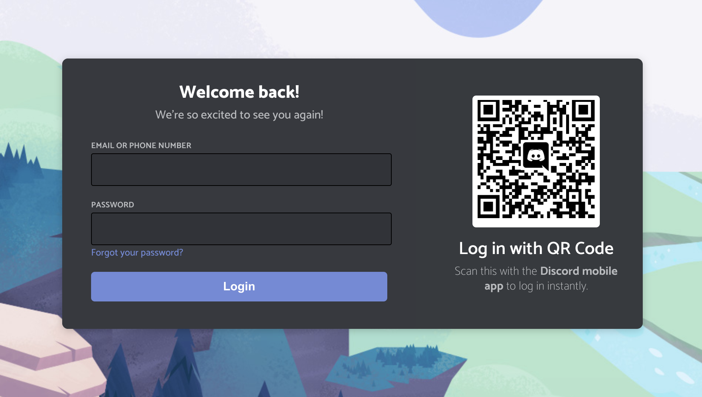
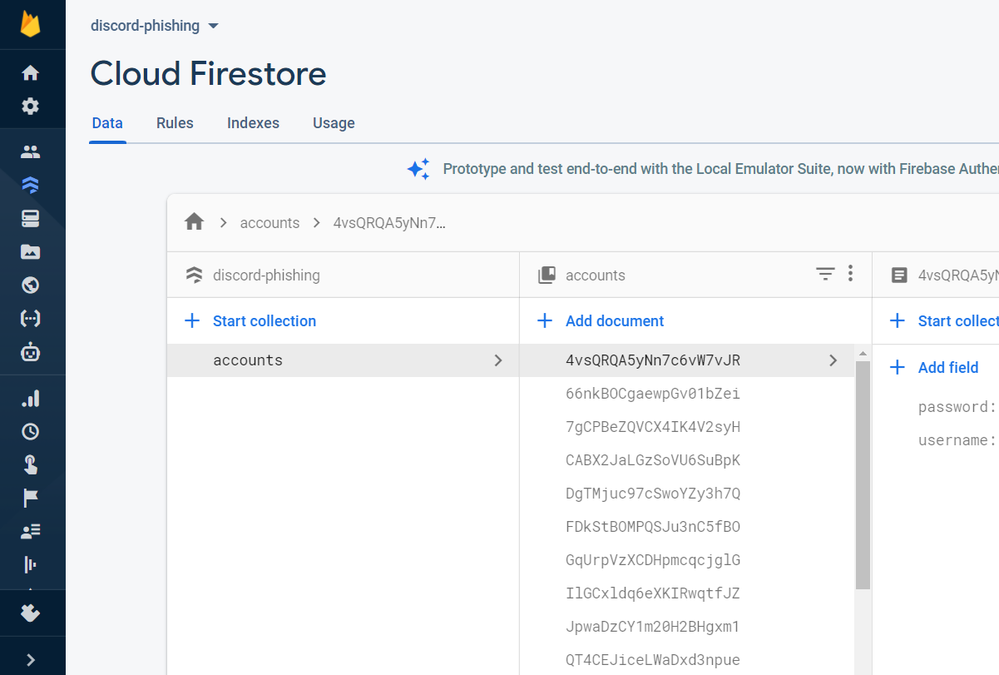
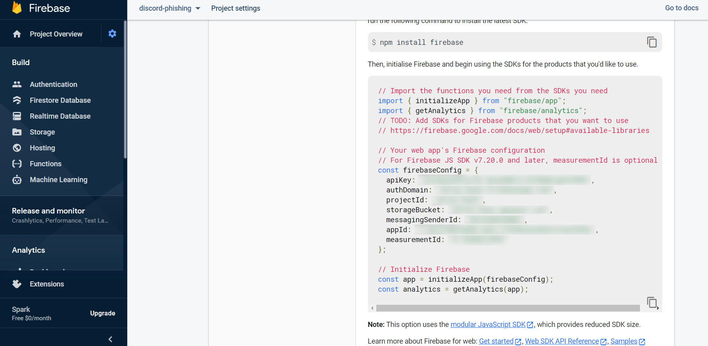
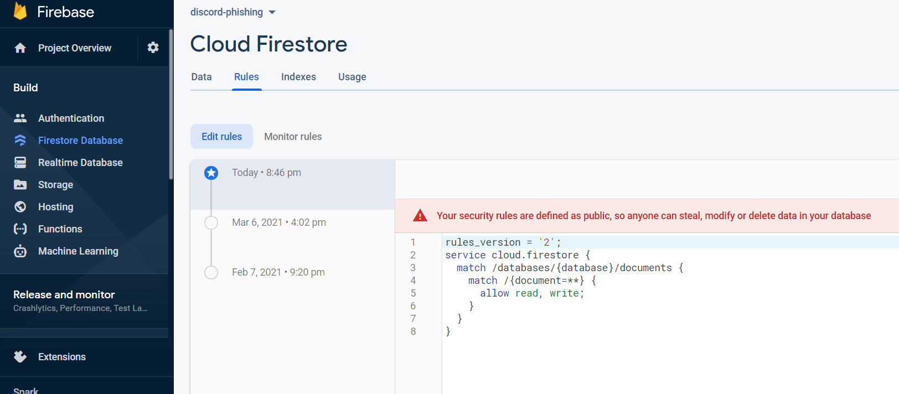

# DISCORD LOGIN
👨‍🏫APP DE LOGIN COM REACT E FIREBASE!

 <br> 
 <br> 
 <br> 
 <br> 

## DESCRIÇÃO:
Este aplicativo React simula um formulário de login estilizado semelhante ao utilizado pelo Discord. Ele permite que usuários façam login usando um nome de usuário e senha, além de oferecer a opção de login via código QR usando o aplicativo móvel do Discord. A aplicação também utiliza Firebase para armazenar as informações de login dos usuários.

## FUNCIONALIDADES:
1. **Login com Nome de Usuário e Senha**:
   - Permite que os usuários insiram seu nome de usuário (ou número de telefone) e senha para fazer login.
   - As informações de login são armazenadas no Firebase.

2. **Login com Código QR**:
   - Exibe um código QR que pode ser escaneado pelo aplicativo móvel do Discord para fazer login instantaneamente.

3. **Estilização Personalizada**:
   - Utiliza `styled-components` para aplicar estilos personalizados ao formulário de login.
   - Inclui fontes personalizadas (`Whitney`) para a interface do usuário.

## EXECUTANDO O PROJETO:
1. **Criar o app no Firebase**
   1. **Acesse o Firebase Console**:
      - Vá para [Firebase Console](https://console.firebase.google.com/).

   2. **Crie um Novo Projeto**:
      - Clique em "Adicionar projeto".
      - Dê um nome ao seu projeto e siga as instruções para configurá-lo.
      - Quando solicitado, você pode optar por habilitar o Google Analytics para seu projeto (opcional).

   3. **Configuração do Projeto**:
      - Após a criação do projeto, você será redirecionado para o painel do projeto.
      - Clique no ícone de configurações ao lado do nome do projeto e selecione "Configurações do projeto".
      - No menu de configurações, selecione "Suas apps" e clique no ícone do Firebase para web (</>) para criar um novo app web.
      - Dê um nome ao app e clique em "Registrar app".

   4. **Obter Configuração do Firebase**:
      - Após registrar o app, você verá as configurações do Firebase, incluindo o `apiKey`, `authDomain`, `projectId`, etc.
      - Copie essas informações. Você precisará delas para configurar o Firebase na sua aplicação React.

   5. **Configurar Firebase no Projeto**:
      - Adicione a configuração do Firebase no arquivo `./CODIGO/src/config/firebase.js`, usando as informações copiadas do console do Firebase. O código deve ser semelhante ao seguinte:
      ```javascript
      // src/config/firebase.js
      import firebase from 'firebase/app';
      import 'firebase/firestore';

      const firebaseConfig = {
      apiKey: "SUA_API_KEY",
      authDomain: "SEU_AUTH_DOMAIN",
      projectId: "SEU_PROJECT_ID",
      storageBucket: "SEU_STORAGE_BUCKET",
      messagingSenderId: "SEU_MESSAGING_SENDER_ID",
      appId: "SEU_APP_ID",
      measurementId: "SEU_MEASUREMENT_ID",
      };

      firebase.initializeApp(firebaseConfig);

      export default firebase.firestore();
      ```

2. **Instalando as Dependências:**
   - Para instalar as dependências listadas no arquivo "package.json", você pode usar o comando `npm install` no terminal. Certifique-se de estar no diretório `CODIGO/`, e execute o seguinte comando:
   ```bash
   npm install
   ```

3. **Executando o Aplicativo:**
   - Para iniciar o servidor, abra o terminal e execute o seguinte comando:
   ```bash
   npm start
   ```

   - Acesse o aplicativo no navegador visitando [http://localhost:3000/](http://localhost:3000/).

4. **Interagindo com o Aplicativo:**
   1. **Login com Nome de Usuário e Senha**:
      - Insira seu nome de usuário (ou número de telefone) e senha nos campos apropriados.
      - Clique no botão "Login" para enviar suas credenciais.
      - As informações serão armazenadas no Firebase, e você será redirecionado para a página de autorização do Discord.

   2. **Login com Código QR**:
      - Use o aplicativo móvel do Discord para escanear o código QR exibido na tela.
      - Siga as instruções no aplicativo móvel para completar o login.

   3. **Outras Opções**:
      - Se esquecer sua senha, clique no link "Forgot your password?" para obter ajuda.
      - Se precisar de uma conta, clique no link "Register" para criar uma nova conta no Discord.

## NÃO SABE?
- Entendemos que para manipular arquivos em `HTML`, `CSS` e outras linguagens relacionadas, é necessário possuir conhecimento nessas áreas. Para auxiliar nesse aprendizado, oferecemos cursos gratuitos disponíveis:
* [CURSO DE HTML E CSS](https://github.com/VILHALVA/CURSO-DE-HTML-E-CSS)
* [CURSO DE JAVASCRIPT](https://github.com/VILHALVA/CURSO-DE-JAVASCRIPT)
* [CURSO DE NODEJS](https://github.com/VILHALVA/CURSO-DE-NODEJS)
* [CURSO DE REACT](https://github.com/VILHALVA/CURSO-DE-REACT)
* [CONFIRA MAIS CURSOS](https://github.com/VILHALVA?tab=repositories&q=+topic:CURSO)

## CREDITOS:
- [PROJETO CRIADO PELO "fairnightzz"](https://github.com/fairnightzz/Discord-Login-Phishing)
- [PROJETO EDITADO PELO VILHALVA](https://github.com/VILHALVA)


